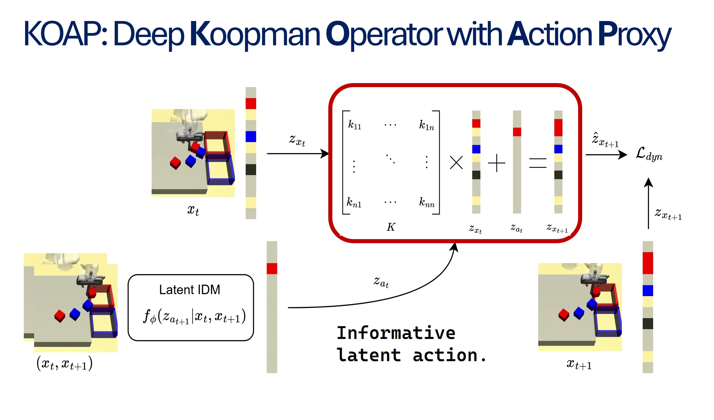

<p align="center">
  <h1 align="center">Imitation Learning with Limited Actions via Diffusion Planners and Deep Koopman Controllers</h1>
</p>

---

[](https://www.pytorch.org)
[](https://github.com/yourusername/koap/blob/master/LICENSE)
[](https://arxiv.org/abs/2410.07584)

This repo is the code implementation for the ICRA 2025 conference paper:
<p align="center">&nbsp;<table><tr><td>
    <p align="center">
    <strong>
        <a href="https://koap-2025.github.io">
            Imitation Learning with Limited Actions via Diffusion Planners and Deep Koopman Controllers
        </a><br/>
    </strong>
    Jianxin Bi <sup>1</sup>, Kelvin Lin <sup>1</sup>, Kaiqi Chen <sup>1</sup>, Yifei Huang <sup>1</sup>, Harold Soh <sup>1,2</sup><br>
    <sup>1</sup><em>Department of Computer Science, National University of Singapore</em><br>
    <sup>2</sup><em>Smart System Institute, NUS</em>
</td></tr></table>&nbsp;


# 🧾 Introduction

---

We present **KOAP**, a novel approach for imitation learning with limited actions that combines diffusion planners with Deep Koopman Controllers. 
Our method addresses the challenge of learning robot action from action-free demonstrations, enabling effective policy learning from limited action-labeled expert demostrations.

<div align="center">
  
</div>

**KOAP** leverages diffusion models for high-level planning while using Deep Koopman Operators to learn from observations for low-level control. 
KOAP enforces learning a linear dynacmis model and action in latent space using Deep Koopman Controller. 
The dynamics model and latent action are jointly learned with obsrvation and trajectory encoder from action-free demostrations.
With limited action data, an action decoder can be trained to decode executable robot actions from latent action.

**KOAP** demonstrates strong performance over existing imitation learning methods, achieving significant improvements in action-data efficiency and robustness to partial-observations across multiple robotic manipulation tasks.

# 💻 Installation

---


## Environment
Install KOAP and D3IL Benchmark:
```bash
# Clone KOAP
git clone https://github.com/jxbi1010/KOAP

# Install D3IL benchmark from the official repository
cd KOAP/src/environments
git clone https://github.com/ALRhub/d3il
cd d3il
pip install -e .
```

Follow `environments/d3il/README.md` to register gym environment.


```bash
# Install Vector-Quantization package for baseline methods:
pip install vector-quantize-pytorch

# Install other dependencies:
pip install -r requirements.txt
```

## Assets
Download the dataset to `environments/dataset/data/` following the D3IL benchmark instructions.
```bash
# Generate observation dataset for training
python create_small_dataset.py
```

# 🛠️ Usage 

---

To reproduce our experimental results, run the following commands:

```bash
# Train and evaluate KOAP method
python run_script_koap.py

# Train and evaluate baseline methods
python run_script_<method>.py
```

Replace `<method>` with the specific baseline method you want to run.

# 🙏 Acknowledgement

---

**KOAP** is based on many open-source projects, including [D3IL](https://github.com/ALRhub/d3il) and various diffusion model implementations. We thank all these authors for their nicely open sourced code and their great contributions to the community.


# 🏷️ License

---

**KOAP** is licensed under the MIT license. See the [LICENSE](LICENSE) file for details.

# 📝 Citation

---

If you find our work useful, please consider citing:
```bibtex
@misc{bi2025imitationlearninglimitedactions,
      title={Imitation Learning with Limited Actions via Diffusion Planners and Deep Koopman Controllers}, 
      author={Jianxin Bi and Kelvin Lim and Kaiqi Chen and Yifei Huang and Harold Soh},
      year={2025},
      eprint={2410.07584},
      archivePrefix={arXiv},
      primaryClass={cs.RO},
      url={https://arxiv.org/abs/2410.07584}, 
}
```